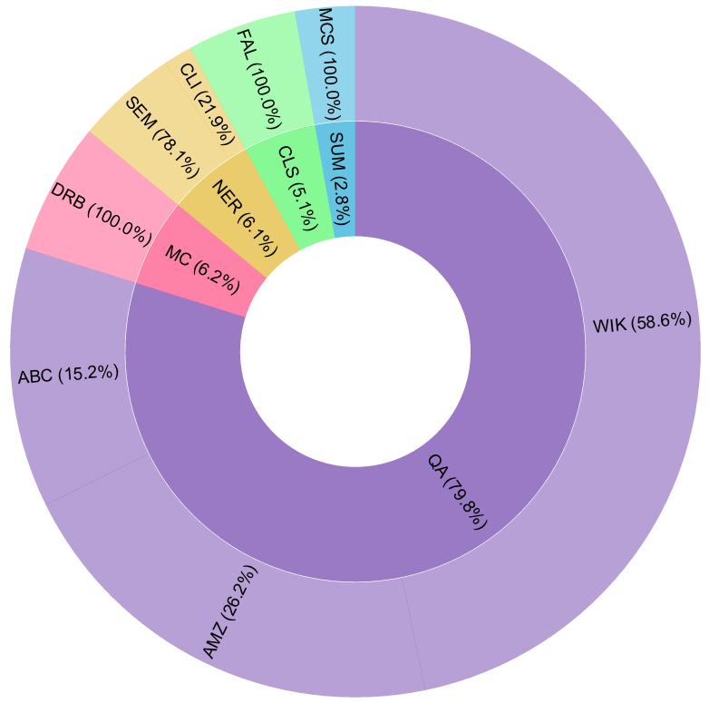

# ClinicalBenchPT

A comprehensive toolkit for processing and preparing clinical NLP datasets for benchmarking in Portuguese.



## Datasets

This benchmark includes 8 datasets covering 5 different tasks:

### Question Answering (QA)
1. **[ABCFarma QA](https://github.com/elossio/corpus)** - Medication to active ingredient mapping
2. **[Amazon Diseases](https://huggingface.co/datasets/juniofreitas/dataset-chatbot-doencas_negligenciadas)** - Diseases QA
3. **[WikiDoc PT](https://huggingface.co/datasets/rhaymison/medicine-medical_meadow_wikidoc_pt)** - Medical knowledge QA

### Multiple Choice
4. **[DrBodeBench](https://huggingface.co/datasets/recogna-nlp/drbodebench)** - Medical exam questions 

### Classification
5. **[Fall Detection](https://github.com/pln-pucrs/fall-detection)** - Clinical notes classification for patient fall risk

### Summarization
6. **[MultiClinSum PT](https://zenodo.org/records/15546018)** - Clinical cases summarization

### Named Entity Recognition (NER)
7. **[SemClinBr](https://github.com/HAILab-PUCPR/SemClinBr)** - Clinical NER with semantic groups
8. **[Clinical NER](https://github.com/fabioacl/PortugueseClinicalNER)** - Biomedical NER with semantic groups

## 🚀 Quick Start

### Installation

```bash
# Clone the repository
git clone https://github.com/yourusername/clinical-benchmark-pt.git
cd clinical-benchmark-pt

# Install dependencies
pip install -r requirements.txt
```

### Usage

**Process all datasets:**
```bash
cd scripts
python build_benchmark.py --output-dir /path/to/output
```

**Process specific datasets:**
```bash
python build_benchmark.py \
    --datasets abcfarma_qa drbodebench wikidoc_pt \
    --output-dir /path/to/output
```

**Custom workspace and datasets directories:**
```bash
python build_benchmark.py \
    --output-dir /path/to/output \
    --workspace-dir /path/to/workspace \
    --datasets-dir /custom/path/to/datasets
```

The script will automatically:
- Process each dataset with appropriate splits
- Save results with reproducibility files

**Note:**  

For copyright, licensing, and redistribution restrictions, this script does not download or clone any dataset automatically.
Instead, you must download or clone each dataset manually following the instructions provided by their respective official sources.

After downloading, place the required files or folders inside:

`../data/raw/`

## 🥐 Croissant Metadata

All datasets in this benchmark are documented using the [Croissant metadata format](http://mlcommons.org/croissant/) (MLCommons standard). This enables:

- **Discoverability**: Better indexing in dataset search engines
- **Reproducibility**: Complete documentation of data structure and preprocessing
- **Interoperability**: Easy loading with standard tools
- **Transparency**: Clear licensing and ethical considerations

Each dataset has a corresponding Croissant metadata file in the [`croissant/`](data/croissant/) directory:

| Dataset | Croissant File | License | Access |
|---------|---------------|---------|--------|
| ABCFarma-QA | [croissant_abcfarma.jsonld](data/croissant/croissant_abcfarma.jsonld) | MIT | Public |
| AmazonDiseases-QA | [croissant_amazon_diseases.jsonldn](data/croissant/croissant_amazon_diseases.jsonld) | Unknown | Public (HF) |
| Wikidoc-pt-QA | [croissant_wikidoc_pt.jsonld](data/croissant/croissant_wikidoc_pt.jsonld) | Apache-2.0 | Public (HF) |
| DrBodeBench-DRB | [croissant_drbodebench_drb.jsonld](data/croissant/croissant_drbodebench_drb.jsonld) | Apache-2.0 | Public (HF) |
| FallDetection-PT | [croissant_fall_detection_pt.jsonld](data/croissant/croissant_fall_detection_pt.jsonld) | AGPL-3.0 | Public |
| MultiClinSum-PT | [croissant_multiclinsum_pt.jsonld](data/croissant/croissant_multiclinsum_pt.jsonld) | CC-BY-4.0 | Public (Zenodo) |
| PortugueseClinicalNER - ClinPT | [croissant_clinpt.jsonld](data/croissant/croissant_clinpt.jsonld) | Unknown | Public |
| SemClinBr - SEM| [croissant_semclinbr_sem.jsonld](data/croissant/croissant_semclinbr_sem.jsonld) | Unknown | Requires permission |

**Note**: These metadata files describe the **preprocessed** datasets generated by our scripts. Users must:

1. Download original datasets from their respective sources
2. Run our preprocessing scripts to generate the standardized format
3. The Croissant files document the structure of the final output


## Project Structure

```
clinical-benchmark-pt/
├── README.md
├── requirements.txt
├── data/                          
│   ├── raw/                       # Manually downloaded datasets (user-provided)
│   ├── croissant/                 # Official Croissant-formatted datasets (.jsonld)
│   │   ├── croissant_abcfarma.jsonld
│   │   ├── croissant_clinpt.jsonld
│   │   ├── croissant_semclinbr.jsonld
│   │   └── ...
│   └── benchmark/                 # Final processed benchmark ready for ML/LLM
│       ├── abcfarma_qa/
│       │   ├── train.jsonl
│       │   ├── dev.jsonl
│       │   └── test.jsonl
│       ├── amazon_diseases/
│       ├── drbodebench/
│       ├── fall_detection/
│       ├── multiclinsum_pt/
│       ├── semclinbr/
│       ├── clinical_ner/
│       └── wikidoc_pt/
├── scripts/
│   ├── build_benchmark.py         # Runs all dataset processors
│   └── run_all_zeroshot.py        # Runs all zeroshot experiments
├── src/
│   ├── data/
│   │   └── processors/            # One processor per dataset
│   │       ├── processor_abcfarma_qa.py
│   │       ├── processor_amazon_diseases.py
│   │       ├── processor_drbodebench.py
│   │       └── ...
│   ├── inference/
│   │   ├── zeroshot_inference.py
│   │   └── lora_inference.py
│   ├── training/
│   │   ├── train_alora.py
│   │   ├── train_dora.py
│   │   ├── train_lora.py
│   │   ├── train_rsora.py
│   │   └── train_vera.py
│   └── evaluation/
│       └── evaluation_metrics.py

```

## Output Format

Each dataset generates the following files:

```
benchmark/
└── dataset_name/
    ├── train.jsonl          # Training set
    ├── dev.jsonl            # Development set
    ├── test.jsonl           # Test set
    ├── full.jsonl           # Complete dataset
    ├── train_ids.json       # Training IDs for reproducibility
    ├── dev_ids.json         # Dev IDs for reproducibility
    └── test_ids.json        # Test IDs for reproducibility
```

### Data Splits
- **Train**: 80%
- **Dev**: 10%
- **Test**: 10%
- **Random Seed**: 42 (for reproducibility)

## Dataset Formats

### Question Answering

#### ABCFarma QA
```json
{
  "id": "1600",
  "question": "Qual é a substância base de 'levoid'?",
  "answer": "levotiroxina sodica",
  "task": "qa"
}
```
#### Amazon Diseases

```json
{
  "id": "03303",
  "question": "Quais são os sinais e sintomas da Leishmaniose?",
  "answer": "A Leishmaniose pode se manifestar de várias formas. Na cutânea, os sintomas incluem lesões de pele que começam como protuberâncias e podem se transformar em úlceras. Na forma visceral, conhecida como Calazar, os sintomas podem incluir febre prolongada, perda de peso, aumento do fígado e baço, e anemia.",
  "task": "qa"
}
```

#### WikidocPT

```json
{
  "id": "05916",
  "question": "Qual é a explicação para a diversidade de anticorpos e imunoglobulinas?",
  "answer": "Praticamente todos os micróbios podem desencadear uma resposta de anticorpos... [resposta truncada]",
  "task": "qa"
}
```


### Multiple Choice

#### DrBodeBench

```json
{
  "id": "00865",
  "enunciado": "Mulher com 42 anos de idade foi atendida em unidade básica de saúde referindo dor na panturrilha direita...",
  "alternativas": {
    "A": "Prescrever repouso, analgésicos e heparina ou enoxaparina por via subcutânea.",
    "B": "Indicar tratamento imediato em hospital terciário.",
    "C": "Solicitar Eco-Doppler colorido venoso de membro inferior.",
    "D": "Prescrever repouso, anti-inflamatório e ácido acetilsalicílico 100 mg ao dia."
  },
  "resposta": "C",
  "task": "multiple_choice"
}
```

### Classification

#### Fall Detection

```json
{
  "id": "00937",
  "Evolucao": "R462 Sintomas e sinais relativos à aparência e ao comportamento... Evoluído por: CRM em NoInfo s NoInfo",
  "Target": 0,
  "task": "classification"
}

```

### Summarization

#### MultiClinSum PT

```json
{
  "id": "multiclinsum_gs_pt_249",
  "text": "Este é um caso de um homem de 23 anos com um histórico médico sem relevância que foi encaminhado com dispneia inexplicada...",
  "summary": "Homem de 23 anos com dispneia grave e acromegalia, submetido a procedimento de Bentall, evoluindo bem após tratamento e acompanhamento.",
  "task": "summarization"
}

```

### Named Entity Recognition

#### SemClinBr

```json
{
  "id": "9622",
  "text": "# Lucas, 58 anos\n# Comorbidades: HAS, Dislipidemia, Tabagismo 115 maços/ano\n# HMA: IAM ST - Killip I em 10 de junho de 2013...",
  "tags": {
    "Abbreviation": ["HAS", "AAS", "IAM"],
    "Disorder": ["Dislipidemia", "Tabagismo", "dispneia", "IAM ST"],
    "Chemicals and Drugs": ["Enalapril", "Brilinta", "Selozok"],
    "Procedures": ["Ecocardiograma transtorácico", "Espirometria"]
  },
  "task": "ner"
}
```

#### ClinPT

```json
{
  "id": "00245",
  "text": "Homem, 60 anos, com antecedentes de HTA, enxaqueca sem aura e malária. Recorreu ao SU por quadro de disfagia e disfonia...",
  "tags": {
    "Condição": ["HTA", "enxaqueca", "malária"],
    "Procedimento": ["nasofibroscopia", "eletromiografia", "radioterapia"],
    "Anatomia": ["corda vocal esquerda", "língua", "nervos cranianos"],
    "Terapia": ["cervicotomia exploradora", "excisão tumoral"]
  },
  "task": "ner"
}
```

## Experimental Protocol

All zero-shot and LoRA evaluation prompts used in the benchmark are documented in the [`docs/prompts.md`](docs/prompts.md) file to ensure full reproducibility of the experimental setup.

## Requirements

- Python 3.9+
- pandas
- datasets (HuggingFace)
- openpyxl (for Excel files)
- tqdm
- torch
- torchvision
- torchaudio
- transformers
- accelerate
- scikit-learn
- rouge_score
- bert_score
- seqeval
- datasets
- peft
- trl
- bitsandbytes

See `requirements.txt` for complete list.

## Contributing

Contributions are welcome! Please feel free to submit a Pull Request.

## License

The benchmark framework, evaluation code, and documentation are released under the Apache 2.0 License.

The datasets included in this benchmark are redistributed or referenced under their original licenses. Users must comply with the terms of each dataset’s license when using this benchmark.

## How to cite

*Very soon*

## 🙏 Acknowledgments

This benchmark integrates multiple publicly available and curated datasets. We thank the authors, institutions, and contributors of each dataset for making their resources accessible to the research community:

- ABCFarma QA
- Amazon diseases
- WikiDoc PT
- DrBodeBench
- Fall Detection
- MultiClinSum PT
- SemClinBr
- Portuguese clinical NER (aka ClinPT)
